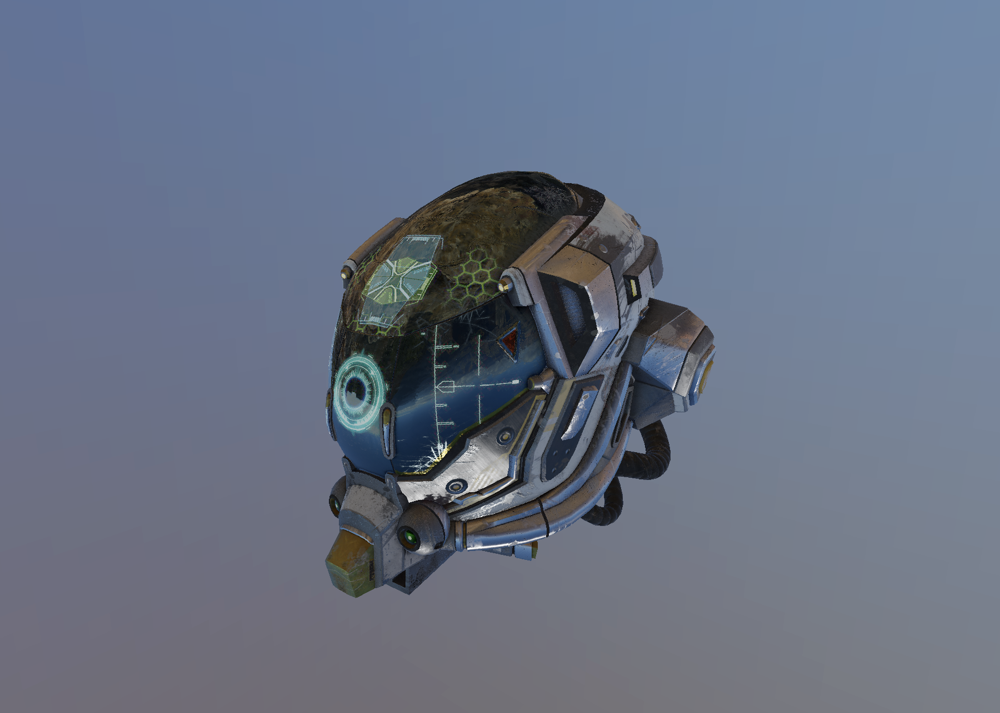
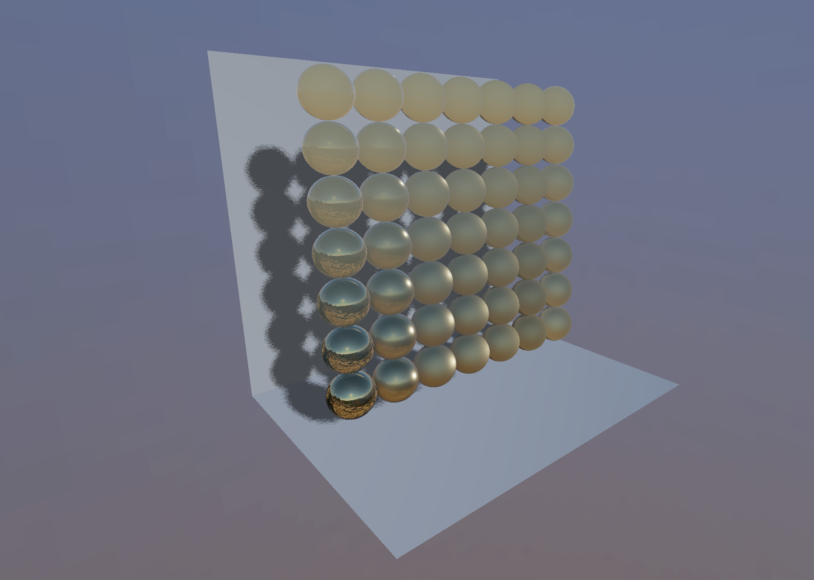

# H2VK - A Vulkan based educational rendering engine 

```
H for Hydrogen. 
The first element of the periodic table.
Or the comburant used by the first successful internal combustion engine.
```

A real-time rendering engine developed as a side-project to learn the Vulkan API, improve C++17 skills and gather graphic computing knowledge.

Given that this project is recent, the list of features implemented remains short. It still features techniques
such as cascaded shadow mapping, image-based lighting and atmospheric scattering.
A long term goal aim at using this work to render solutions obtained from physic simulations with closure modelling.

## Pre-requisites

### OS X

```
brew install molten-vk
brew install vulkan-loader
brew install glfw
brew install glslang
brew install git-lfs
```

### Linux

```
sudo apt-get update && sudo apt-get install mesa-common-dev libglfw3-dev libvulkan-dev glslang-tools
```

## Download

```
git clone --recurse-submodules https://github.com/vdesgrange/H2Vk.git
git lfs pull
```

## How to build & run

```
mkdir build
cd build
cmake ..
make
cd ../bin
./h2vk
```

## Features

- Physic-Based Rendering (PBR)
- Image-Based Lighting (IBL)
- Cascaded Shadow mapping
- glTF import
- Keyboard and mouse input

### Work in progress
- Atmosphere

## Snapshots





## References

Hillaire, Sébastien. (2020). A Scalable and Production Ready Sky and Atmosphere Rendering Technique. Computer Graphics Forum. 10.1111/cgf.14050.

