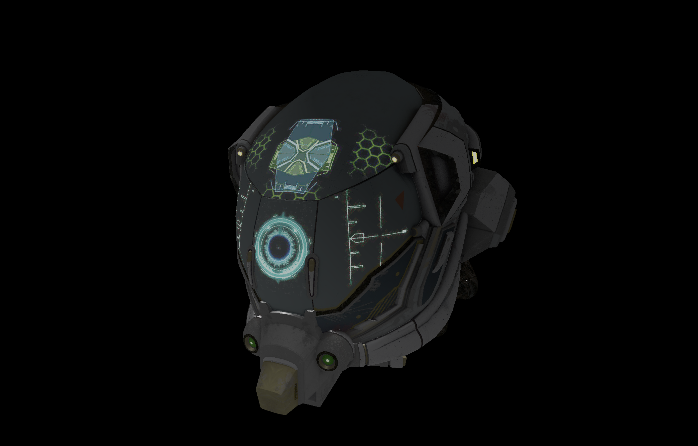

# H2VK - A Vulkan based educational graphic engine 

```
H for Hydrogen. 
The first element of the periodic table.
Or the comburant used by the first successful internal combustion engine.
```

An small graphic engine developed as a side-project to learn the Vulkan API, improve C++ skills and gather graphic computing knowledge.

Given that this project is recent, the list of features implemented remains short.
A long term goal aim at using this work to render solutions obtained from physic simulations with closure modelling.

## Snapshots




## How to build

Coming soon...

## References

- [Vulkan tutoriel](https://vulkan-tutorial.com)
- [Introduction to vulkan](https://vkguide.dev/)
- [Examples and demos](https://github.com/SaschaWillems/Vulkan)
